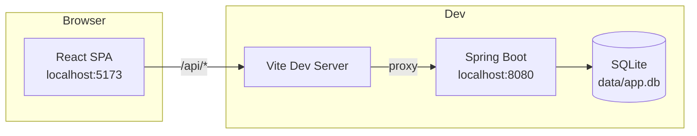
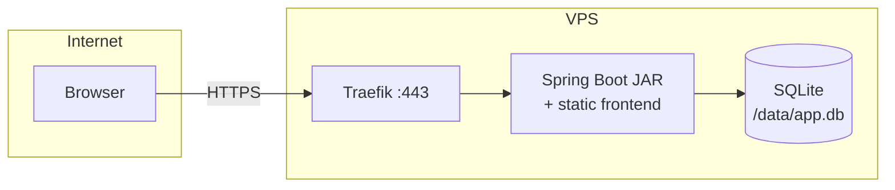
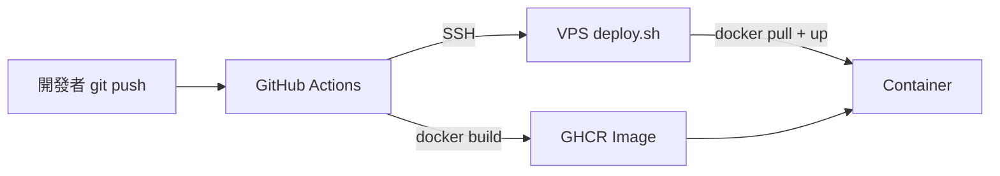
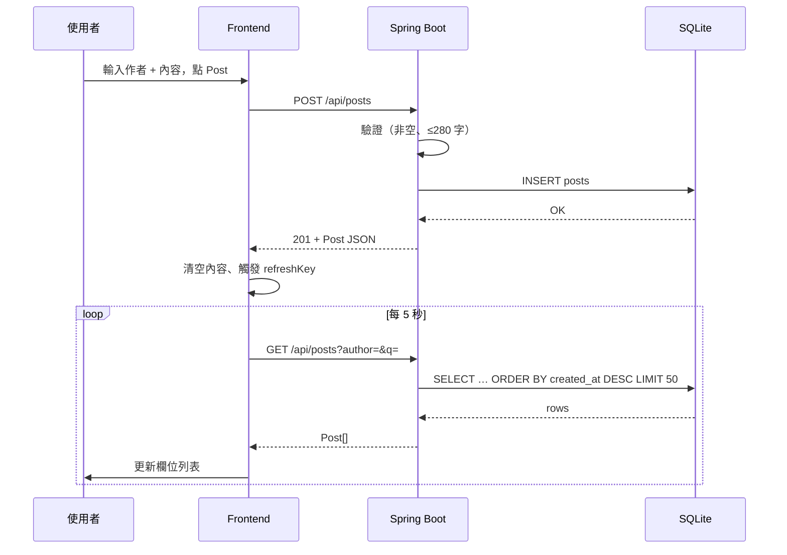
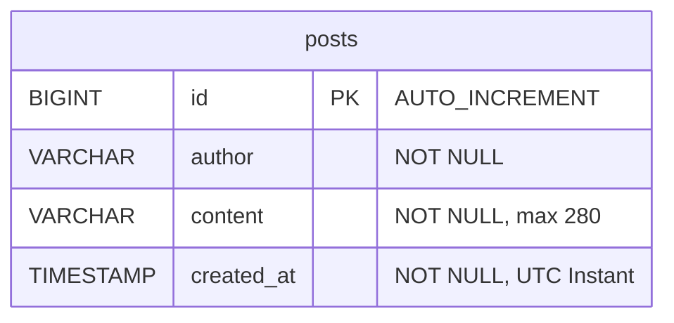
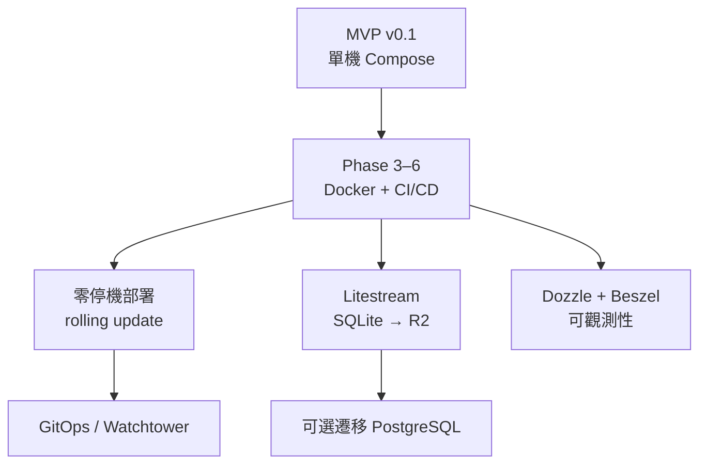

# Obechow（Skan）技術方案

> **Repo:** [github.com/fallrising/obechow](https://github.com/fallrising/obechow)  
> **版本：** MVP v0.1  
> **最後更新：** 2026-07-16

---

## 1. 專案概述

Obechow（代號 Skan）是一個**最小可行 Twitter Deck 克隆**：使用者可在橫向捲動的多欄介面中瀏覽、搜尋、發佈短貼文（280 字以內）。資料持久化至 SQLite，無需外部資料庫服務。

**設計目標：**

- 本地開發簡單（兩個 terminal 即可跑通）
- 單一 Docker image 可部署至 VPS
- CI/CD 路徑清晰：`git push` → GHCR → SSH deploy

**相關文檔：**

| 文檔 | 用途 |
|------|------|
| [README.md](../README.md) | 快速入門、API 速查 |
| [WORK_LOG.md](../WORK_LOG.md) | 開發過程紀錄 |
| [CI_CD_RUNBOOK.md](./CI_CD_RUNBOOK.md) | 部署操作手冊 |
| 本文檔 | 技術架構、選型、規格、進度 |

---

## 2. 系統架構

### 2.1 應用架構（開發模式）



### 2.2 應用架構（生產模式 — 目標）



前端 build 產物嵌入 Spring Boot 的 `classpath:/static`，由同一個 process serve API 與 SPA，不需獨立 nginx 容器。

### 2.3 CI/CD 架構（目標）



詳見 [CI_CD_RUNBOOK.md](./CI_CD_RUNBOOK.md)。

### 2.4 請求資料流



---

## 3. 技術選型

### 3.1 選型總表

| 層級 | 技術 | 版本 | 選型理由 |
|------|------|------|----------|
| 後端框架 | Spring Boot | 3.3.5 | 成熟 REST + JPA 生態，單 JAR 部署簡單 |
| 語言 | Java | 17 LTS | Boot 3 基線，長期支援 |
| 建置 | Maven | 3.9+ | 與 Spring 官方模板一致 |
| ORM | Spring Data JPA | — | 減少 CRUD 樣板碼 |
| 資料庫 | SQLite | 3.x | 零運維、單檔案、適合 MVP 單機 |
| SQLite 方言 | hibernate-community-dialects | Boot parent 版 | 官方社群維護的 SQLiteDialect |
| 前端框架 | React | 19 | 元件化、生態完整 |
| 建置工具 | Vite | 8.x | 快速 HMR、簡潔配置 |
| 語言 | TypeScript | 5.x | 型別安全 |
| 樣式 | Tailwind CSS | 4.x | utility-first，與 shadcn 搭配 |
| UI 元件 | shadcn/ui | — | 可複製貼上的無障礙元件，非黑盒依賴 |
| Ingress | Traefik | v3 | Docker label 驅動，自動 Let's Encrypt |
| 映像倉庫 | GHCR | — | 與 GitHub 整合，private repo 免費 |
| CI | GitHub Actions | — | push 觸發 build + deploy |

### 3.2 為什麼不用 K8s / PostgreSQL / WebSocket？

| 決策 | 理由 |
|------|------|
| **單 VPS + Docker Compose** 而非 K8s | MVP 階段一台機器足夠；Compose desired state 已能表達部署意圖，複雜度低 |
| **SQLite** 而非 PostgreSQL | 無連線池、無額外 container；WAL 模式支援併發讀；日後可用 Litestream 備份 |
| **輪詢（5s）** 而非 WebSocket | 實作最簡單；MVP 不需即時推送；日後可換 SSE 或 WS |
| **無認證** | MVP 聚焦 Deck 體驗；作者名稱為自由文字輸入，存 localStorage |

### 3.3 目錄結構

```
obechow/
├── backend/
│   ├── pom.xml
│   └── src/main/
│       ├── java/com/skan/
│       │   ├── SkanApplication.java
│       │   ├── config/          # SpaFallbackFilter
│       │   ├── controller/      # HealthController, PostController
│       │   ├── dto/             # CreatePostRequest
│       │   ├── entity/          # Post
│       │   └── repository/      # PostRepository
│       └── resources/
│           └── application.yml
├── frontend/
│   ├── src/
│   │   ├── api/posts.ts         # fetch 封裝
│   │   ├── components/
│   │   │   ├── ComposeBox.tsx
│   │   │   ├── PostColumn.tsx
│   │   │   └── ui/              # shadcn: card, button, input, textarea
│   │   ├── lib/utils.ts
│   │   ├── types/post.ts
│   │   ├── App.tsx
│   │   └── main.tsx
│   ├── vite.config.ts
│   └── package.json
├── docs/
│   ├── TECH_SPEC.md             # 本文檔
│   └── CI_CD_RUNBOOK.md
├── README.md
└── WORK_LOG.md
```

---

## 4. 資料庫設計

### 4.1 ER 圖



### 4.2 Schema（Hibernate `ddl-auto: update` 自動建表）

| 欄位 | 型別 | 約束 | 說明 |
|------|------|------|------|
| `id` | `INTEGER` (SQLite) | PK, AUTOINCREMENT | 貼文 ID |
| `author` | `TEXT` | NOT NULL | 作者顯示名稱（自由文字，無 FK） |
| `content` | `TEXT` | NOT NULL, length ≤ 280 | 貼文內容 |
| `created_at` | `TEXT` / Instant | NOT NULL | ISO-8601 UTC，由 `@PrePersist` 設定 |

### 4.3 儲存配置

```yaml
spring.datasource.url: jdbc:sqlite:${DB_PATH:/data/app.db}?journal_mode=WAL
```

| 環境 | `DB_PATH` 建議值 |
|------|------------------|
| 本地開發 | `../data/app.db` |
| Docker | `/data/app.db`（volume mount `./data:/data`） |

WAL 模式允許讀寫併發，適合輪詢讀取 + 間歇寫入。

---

## 5. API 規格

Base URL：開發 `http://localhost:8080`，生產 `https://deck.<網域>`

### 5.1 `GET /api/health`

健康檢查，供 Traefik / Docker healthcheck 使用。

**Response `200`**

```json
{ "status": "ok" }
```

---

### 5.2 `GET /api/posts`

取得最新貼文列表。

**Query Parameters**

| 參數 | 型別 | 必填 | 說明 |
|------|------|------|------|
| `author` | string | 否 | 精確比對作者名稱 |
| `q` | string | 否 | 內容關鍵字（大小寫不敏感 LIKE） |

**行為**

- 依 `createdAt` **降序**排列
- 最多回傳 **50** 筆
- `author` 與 `q` 可同時使用（AND 條件）
- 空字串視為未篩選

**Response `200`**

```json
[
  {
    "id": 1,
    "author": "alice",
    "content": "Hello Skan!",
    "createdAt": "2026-07-13T18:09:13.845Z"
  }
]
```

---

### 5.3 `POST /api/posts`

建立貼文。

**Request Body** `application/json`

```json
{
  "author": "alice",
  "content": "Hello Skan!"
}
```

**驗證規則**

| 規則 | 錯誤碼 |
|------|--------|
| `author` 不可為空 | `400` |
| `content` 不可為空 | `400` |
| `content` 長度 > 280 | `400` |

前後空白會被 `trim()`。

**Response `201`**

```json
{
  "id": 1,
  "author": "alice",
  "content": "Hello Skan!",
  "createdAt": "2026-07-13T18:09:13.845854208Z"
}
```

---

### 5.4 SPA Fallback

| 條件 | 行為 |
|------|------|
| `GET` 且路徑**不以** `/api` 開頭 | 檢查是否有副檔名 |
| 路徑**無**副檔名（如 `/`、`/deck`） | 轉發至 `/index.html` |
| 有副檔名（如 `/assets/app.js`） | 正常 serve 靜態檔 |

實作：`SpaFallbackFilter`；靜態檔由 Spring Boot 預設的 `classpath:/static` resource handler 提供。

---

## 6. 前端架構

### 6.1 元件樹

```
App
├── ComposeBox          # 發文區
│   ├── Input (author)
│   ├── Textarea (content + 280 計數)
│   └── Button (Post)
└── [橫向捲動區]
    ├── PostColumn "All"       # 無篩選
    ├── PostColumn "Mine"      # author 篩選 + 輸入框
    └── PostColumn "Search"    # q 關鍵字 + 輸入框
        └── Card × N (每則貼文)
```

### 6.2 狀態管理

| 狀態 | 位置 | 說明 |
|------|------|------|
| `author` | `App` + `localStorage['skan-author']` | 發文用作者名，跨 session 保留 |
| `mineFilter` | `App` | Mine 欄篩選值，預設跟 author 同步 |
| `searchQuery` | `App` | Search 欄關鍵字 |
| `refreshKey` | `App` | 發文成功後遞增，強制各欄重載 |

無 Redux / Zustand；MVP 用 React `useState` + props 即可。

### 6.3 輪詢機制

`PostColumn` 在 `useEffect` 中：

1. 掛載時立即 `fetchPosts({ author, q })`
2. 設定 `setInterval(load, 5000)`
3. 依 `author`、`q`、`refreshKey` 變化重新訂閱

### 6.4 開發代理

`vite.config.ts`：

```ts
server: {
  proxy: { '/api': 'http://localhost:8080' }
}
```

---

## 7. 功能清單與進度

### 7.1 應用功能

| 功能 | 狀態 | 備註 |
|------|------|------|
| 發佈貼文（280 字） | ✅ 完成 | POST /api/posts |
| 全部貼文欄（All） | ✅ 完成 | 最新 50 則 |
| 作者篩選欄（Mine） | ✅ 完成 | `?author=` |
| 關鍵字搜尋欄（Search） | ✅ 完成 | `?q=` |
| 5 秒輪詢更新 | ✅ 完成 | 每欄獨立 interval |
| 作者名稱 localStorage | ✅ 完成 | key: `skan-author` |
| 健康檢查端點 | ✅ 完成 | GET /api/health |
| SPA fallback | ✅ 完成 | 支援直接重新整理深層路徑 |
| 使用者登入 / 註冊 | ❌ 未規劃 MVP | — |
| 按讚 / 轉推 / 回覆 | ❌ 未規劃 MVP | — |
| 自訂欄位（多欄配置） | ❌ 未規劃 MVP | — |
| WebSocket 即時推送 | ❌ 未規劃 MVP | 輪詢替代 |
| 圖片 / 附件 | ❌ 未規劃 MVP | — |
| 分頁 / 無限捲動 | ❌ 未規劃 MVP | 固定 50 則上限 |

### 7.2 工程 / 部署進度

| Phase | 狀態 | 交付物 |
|-------|------|--------|
| Phase 0 — VPS 準備 | ⬜ 待做 | Docker、edge network、`/srv` |
| Phase 1 — Traefik | ⬜ 待做 | `/srv/edge/compose.yml`、DNS |
| Phase 2 — 應用 MVP | ✅ 完成 | `backend/` + `frontend/` |
| Phase 3 — Dockerfile | ✅ 完成 | 單一 image，前端嵌入 static |
| Phase 4 — GitHub Actions | ⬜ 待做 | `.github/workflows/deploy.yml` |
| Phase 5 — VPS app | ⬜ 待做 | compose + `/srv/deploy.sh` |
| Phase 6 — 線上驗收 | ⬜ 待做 | push → 2–4 分鐘看到新版 |

### 7.3 文檔進度

| 文檔 | 狀態 |
|------|------|
| README.md | ✅ |
| WORK_LOG.md | ✅ |
| CI_CD_RUNBOOK.md | ✅ |
| TECH_SPEC.md（本文檔） | ✅ |

---

## 8. 部署規格摘要

> 完整步驟見 [CI_CD_RUNBOOK.md](./CI_CD_RUNBOOK.md)

| 項目 | 值 |
|------|-----|
| Image | `ghcr.io/fallrising/obechow:<tag>` |
| Container port | 8080 |
| 資料 volume | `/srv/apps/twitter-deck/data` → `/data` |
| 對外網域 | `deck.<你的網域>` |
| TLS | Traefik + Let's Encrypt（HTTP-01 或 CF DNS-01） |
| Deploy 觸發 | `push` to `main` |
| Deploy 指令 | `/srv/deploy.sh twitter-deck <git-sha>` |

---

## 9. 後續演進路線



| 階段 | 目標 | 觸發條件 |
|------|------|----------|
| v0.2 | Dockerfile + GHA 打通 | Phase 6 驗收通過 |
| v0.3 | Litestream 備份 | 有真實使用者資料 |
| v0.4 | 零停機 deploy | downtime 不可接受時 |
| v1.0 | 認證 + 多使用者 | 產品化需求明確時 |

---

## 10. 修訂紀錄

| 日期 | 版本 | 變更 |
|------|------|------|
| 2026-07-16 | v0.1 | 完成 Phase 3：單一 Docker image 與 classpath static 驗證 |
| 2026-07-13 | v0.1 | 初版：架構、選型、API、前端、進度總表 |
